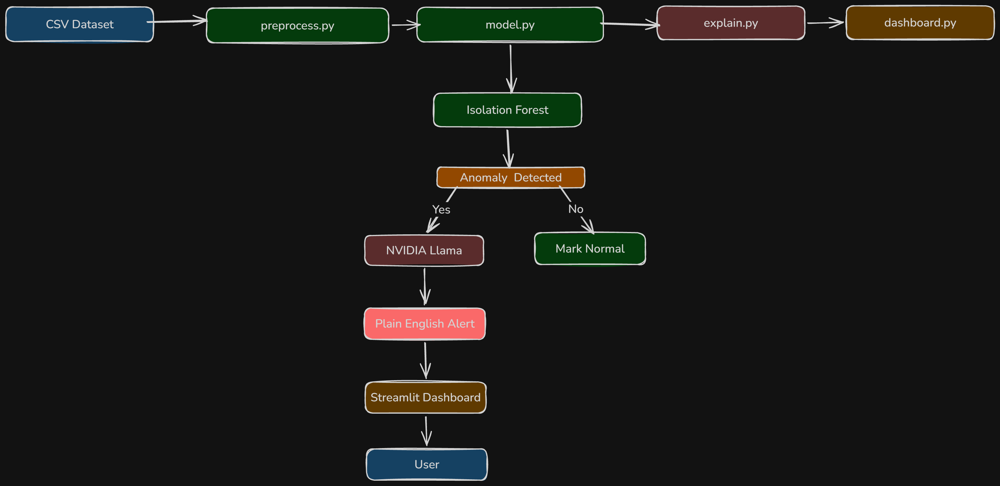

# 🛡️ SecureIntel — DNS Guardian

> An open-source network anomaly detection system that watches your traffic, spots suspicious behaviour, and explains it in plain English.

🌐 **Live Demo:** [SecureIntel - DNS Gaurdian](https://secureintel-dns-guardian-hnmrvawde2yq3abu6fekxn.streamlit.app/)


---

## 🤔 What is this?

Most security tools speak in jargon nobody understands. SecureIntel is different — it detects suspicious network behaviour and tells you in simple language what's happening and why it matters.

**Instead of:**
> `Anomalous TTL deviation detected on port 53 with entropy 7.2`

**You get:**
> `Something on your network is quietly sending data to an unknown server. This looks like it could be malware. Avoid clicking any links from this domain.`

---

## 👥 Who is this for?

- 🏠 Home network owners
- 🏪 Small business owners
- 🏫 Schools and NGOs without dedicated IT teams
- 👨‍💻 Security students and researchers
- 🌍 Anyone who wants free, accessible cybersecurity

---

## 🏗️ System Architecture



---

## ⚙️ How it works

```
CSV Dataset → preprocess.py → model.py → explain.py → dashboard.py
                                  ↓
                          Isolation Forest (ML)
                                  ↓
                         Anomaly Detected?
                          ↓ Yes      ↓ No
                    NVIDIA Llama   Mark Normal
                          ↓
                  Plain English Alert
                          ↓
                  Streamlit Dashboard
                          ↓
                         User
```

---

## 💻 Tech Stack

| Component | Tool | Cost |
|-----------|------|------|
| Language | Python 3.11 | Free |
| ML Model | scikit-learn (Isolation Forest) | Free |
| LLM Layer | NVIDIA Llama 3.1 | Free |
| Dashboard | Streamlit | Free |
| Deployment | Streamlit Community Cloud | Free |
| Dataset | Cybersecurity Threat Intel 2026 | Free |

**Total cost to run: $0** ✅

---

## 📊 Model Performance

| Metric | Value |
|--------|-------|
| Total Records Analysed | 162 |
| Anomalies Detected | 25 |
| Normal Records | 137 |
| Anomaly Rate | 15.43% |
| Contamination Parameter | 0.15 |

---

## 🚀 Quick Start

```bash
git clone https://github.com/Nathan-sudo-pycharm/secureintel-dns-guardian
cd secureintel-dns-guardian
pip install -r requirements.txt
streamlit run app/dashboard.py
```

### Environment Setup

Create a `.env` file in the root directory:

```
NVIDIA_API_KEY=your_nvidia_api_key_here
```

Get your free NVIDIA API key at [build.nvidia.com](https://build.nvidia.com/models)

---

## 📁 Project Structure

```
secureintel-dns-guardian/
├── src/
│   ├── preprocess.py       # Data loading and feature engineering
│   ├── model.py            # Isolation Forest training and inference
│   ├── explain.py          # NVIDIA Llama AI explanation generation
│   └── pipeline.py         # Orchestrates all stages
├── app/
│   ├── dashboard.py        # Streamlit dashboard
│   └── config.py           # API key configuration
├── data/
│   └── sample_traffic.csv  # Sample data
├── results/
│   ├── metrics.json        # Model performance metrics
│   └── *.png               # Generated charts
├── notebooks/
│   └── exploration.ipynb   # EDA and analysis
└── docs/
    └── architecture.png    # System architecture diagram
```

---

## 🔍 Features

- ✅ **Multi-domain checker** — check multiple domains simultaneously
- ✅ **Real threat database** — uses actual vote data when domain is known
- ✅ **AI explanations** — plain English alerts powered by NVIDIA Llama 3.1
- ✅ **Live dashboard** — interactive Streamlit interface
- ✅ **Open source** — MIT licensed, free for everyone
- ✅ **Zero cost** — runs entirely on free tier services

---

## ⚠️ Known Limitations

- Domain checker for unknown domains relies on structural features only
- A larger dataset would improve model performance
- Adding a live VirusTotal API would significantly improve accuracy for unknown domains

---

## 🔮 Future Work

- Integrate live VirusTotal API for real-time domain reputation
- Add LSTM model for temporal pattern detection
- Add email alert system for detected anomalies
- Support for IPv6 analysis
- Browser extension for real-time checking

---

## 💡 Motivation

Built from real-world experience resolving 60+ DNS and network security tickets per shift at Bluehost. This project is a structured investigation of suspicious traffic patterns observed in production environments, combined with machine learning and AI to make security accessible to everyone.

---

## 🤝 Contributing

Contributions are welcome! Please open an issue first to discuss what you'd like to change.

---

## 📄 License

MIT License — free to use, modify, and distribute.

---

## 📂 Dataset

Domain threat data sourced from the [Cybersecurity Attacks & Defense Dataset 2026](https://www.kaggle.com/datasets/chuneeb/ai-cybersecurity-threat-dataset-2026) on Kaggle.
